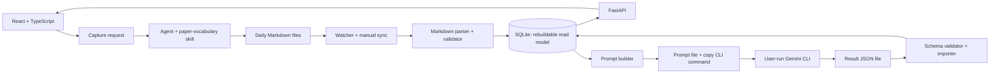

# Vocabulary Learning Platform — đặc tả thiết kế chốt v1

## 1. Phạm vi và cách phân loại tài liệu

Tài liệu này tách ba loại thông tin để tránh biến hướng dẫn của agent thành yêu cầu sản phẩm:

| Nguồn | Vai trò | Quyết định sử dụng |
|---|---|---|
| `paper-vocabulary/SKILL.md` trong file ZIP | Hợp đồng vận hành cho agent xử lý một từ/cụm từ và ghi vào nhật ký Markdown | Giữ quy ước ngày, heading, bảng tra cứu nhanh, Cambridge link và trạng thái IPA; bổ sung lớp metadata để hệ thống đọc ổn định |
| `docs/vocabularies/*.md` hiện có | Dữ liệu thực tế và ví dụ định dạng | Phải đọc được ngược tương thích; không bắt buộc sửa các file cũ |
| `sci-link_clone` | Tài liệu tham chiếu giao diện, gồm inventory, phân tích layout, token và screenshot | Chỉ tái sử dụng ngôn ngữ thị giác và component pattern; không sao chép các route marketing, auth hoặc classroom không cần thiết |
| Yêu cầu của người dùng | Mục tiêu sản phẩm và giới hạn triển khai | Là nguồn ưu tiên để chốt scope, kiến trúc và thứ tự phát triển |

Repository tham chiếu mô tả một app shell dark glass với sidebar, top search, thẻ số liệu, chart và mobile drawer. Nó không phải một codebase frontend/backend hoàn chỉnh nên cần dựng lại component system có phạm vi nhỏ hơn.

## 2. Kết quả audit

### 2.1. Hợp đồng Markdown và skill

Điểm tốt:

- Quy ước `DD-MM-YYYY.md`, timezone `Asia/Bangkok` và tiêu đề ngày rõ ràng.
- Bảng `Tra cứu nhanh` liên kết tới heading chi tiết nên phù hợp cho người đọc.
- Có chuẩn hóa lemma, Cambridge US IPA, ví dụ tiếng Anh và bản dịch tiếng Việt.
- Có quy tắc kiểm tra trùng mục trong cùng ngày và kiểm tra liên kết heading.

Điểm cần chỉnh:

| Mức | Vấn đề | Cách sửa trong hệ thống |
|---|---|---|
| P0 | Markdown không có schema version, ID hay trạng thái parse | Parser xác định phiên bản bằng cấu trúc; thêm front matter tùy chọn cho file mới, nhưng vẫn đọc file cũ |
| P0 | Chưa có cơ chế đồng bộ và xử lý file bị sửa/xóa | SQLite lưu `content_sha256`, mtime, trạng thái sync; import idempotent, lỗi không xóa dữ liệu lần trước |
| P1 | Trùng lemma ở nhiều ngày chưa có khái niệm một mục từ dùng chung | Tách `term` dùng chung khỏi `term_occurrence` theo ngày; ngày ghi chú vẫn lọc được độc lập |
| P1 | Dữ liệu nguồn, dòng/heading và context chưa có khóa ổn định | Lưu đường dẫn tương đối, heading anchor, số dòng gần đúng, surface form và trích dẫn nguồn |
| P1 | IPA/Cambridge phụ thuộc web và có thể chưa xác minh | Lưu `ipa_status`: `verified`, `unverified`, `not_found`; không đoán IPA khi skill không xác minh được |
| P1 | Bảng Markdown phù hợp đọc bằng mắt nhưng dễ vỡ khi parse tự động | Parser dùng AST Markdown + luật cấu trúc heading/bảng; có trang báo lỗi theo từng file |
| P2 | Skill yêu cầu tìm project root ngầm định | Ứng dụng dùng `VOCAB_ROOT` cấu hình rõ ràng, mặc định là workspace hiện tại |
| P2 | Agent có thể ghi thiếu hoặc sai bảng liên kết | Import chạy trong transaction, báo lỗi và không publish bản chiếu mới nếu vi phạm invariant |

Markdown nên tiếp tục là nguồn chuẩn vì người dùng có thể đọc, sao lưu và chỉnh bằng Git/editor. SQLite chỉ là read model có thể dựng lại bất cứ lúc nào.

### 2.2. Gemini CLI và giới hạn chi phí

Gemini CLI hiện hỗ trợ headless mode và JSON output, nên về kỹ thuật có thể dùng làm worker cục bộ. Tuy nhiên tài liệu chính thức nêu rằng việc một phần mềm/dịch vụ bên thứ ba truy cập dịch vụ Gemini CLI bằng OAuth có thể vi phạm điều khoản. Vì vậy bản MVP **không nhúng token, không tự đăng nhập, không gọi OAuth từ FastAPI**.

Luồng mặc định là “manual CLI bridge”: app tạo prompt file, hiển thị lệnh để người dùng chạy bằng CLI đã đăng nhập trên máy, sau đó app import result JSON. Cách này vẫn dùng tài khoản Google AI Pro và không dùng API trả phí, nhưng giữ ranh giới xác thực ở CLI do người dùng điều khiển.

`gemini-3.8-flash` là model ID hợp lệ trong danh sách model hiện tại. Settings nên lưu model được yêu cầu, phiên bản CLI và model thực tế xuất hiện trong stats của kết quả; nếu CLI resolve sang model khác thì job chỉ được import kèm cảnh báo, không ghi nhận im lặng như đúng model.

Có thể thêm adapter gọi subprocess ở bản sau như tính năng opt-in, nhưng phải có cờ cấu hình, cảnh báo điều khoản và không được bật mặc định.

### 2.3. Giao diện clone

Nên giữ:

- Canvas tối, ambient blobs rất nhẹ, panel kính, viền alpha thấp.
- Sidebar desktop và drawer mobile.
- Hero/action card, metric cards, chart container, search và trạng thái loading/empty/error.
- Violet–fuchsia làm màu hành động chính, màu semantic cho success/warning/error.

Nên bỏ hoặc sửa:

- Bỏ landing page, đăng ký, login, notices, live classroom, leaderboard và profile nhiều trường vì đây là app cá nhân local.
- Không dùng root font 12 px ở desktop rồi nhảy lên 16 px dưới breakpoint 1024; độ nhảy này làm chữ và khoảng cách khó đọc. Dùng base 16 px, body 14–16 px và responsive scale liên tục.
- Không duy trì global search “trang trí” nhưng không có kết quả. Search phải tìm lemma, nghĩa, ngày ghi chú và quiz.
- Giảm blur/animation; tôn trọng `prefers-reduced-motion` và giữ tương phản nội dung học tập cao hơn hiệu ứng kính.
- Không dùng số liệu giả như rank hoặc live data. Dashboard chỉ hiển thị số liệu tính từ review, quiz và sync thật.

## 3. Mục tiêu và giới hạn v1

Ứng dụng chạy trên một máy, một người dùng, bind mặc định vào `127.0.0.1`. Chức năng bắt buộc:

1. Nhập từ/cụm từ mới kèm câu nguồn tùy chọn; gọi skill dịch thuật để chuẩn hóa và ghi vào Markdown.
2. Theo dõi thư mục nhật ký Markdown theo ngày và đổ dữ liệu vào SQLite.
3. Xem từ theo ngày ghi chú, tìm kiếm và mở lại context/nguồn.
4. Ôn flashcard theo ngày hoặc theo các thẻ đến hạn.
5. Tạo bài kiểm tra gồm tự luận, trắc nghiệm và đục lỗ; số câu mỗi loại do người dùng chọn.
6. Chấm tự động phần trắc nghiệm/đục lỗ, cho tự chấm tự luận theo rubric.
7. Dashboard hiển thị tiến độ, streak, backlog, retention gần đúng, lịch sử quiz và lỗi sync.
8. Gọi Gemini qua manual CLI bridge, không cần API key trả phí.

Không làm trong v1: multi-user, cloud sync, đăng ký tài khoản, mobile native app, thanh toán, leaderboard, video/live classroom, chỉnh Markdown trực tiếp trong trình duyệt, hay tự động gọi Cambridge để tạo lại toàn bộ dữ liệu cũ.

## 4. Kiến trúc chốt



### Backend

- Python 3.12+, FastAPI, Pydantic v2.
- SQLAlchemy 2 + Alembic; SQLite WAL mode và foreign keys bật.
- `watchfiles` để debounce thay đổi thư mục; vẫn có nút “Sync now”.
- `markdown-it-py` hoặc parser AST tương đương, không parse bằng regex toàn bộ file.
- SQLite FTS5 cho tìm kiếm lemma, nghĩa, context và ví dụ.
- Không cần Redis/Celery trong local v1. Các tác vụ sync/import ngắn chạy trong process; quiz generation là job bền vững lưu trong DB và được cập nhật trạng thái.

### Frontend

- React + TypeScript + Vite.
- React Router cho route; TanStack Query cho cache/invalidation; thư viện chart nhẹ như Recharts.
- CSS variables hoặc Tailwind dùng token riêng; không bê nguyên các breakpoint/root-scale bất thường của clone.

### Cấu trúc thư mục đề xuất

```text
backend/
  app/
    main.py
    config.py
    db.py
    models/
    schemas/
    routes/
    services/
      markdown_sync.py
      markdown_parser.py
      scheduler.py
      quiz_prompt.py
      quiz_import.py
    workers/
frontend/
  src/
    app/
    components/
    features/dashboard/
    features/vocabulary/
    features/review/
    features/quiz/
    features/analytics/
    features/settings/
docs/vocabularies/
.local/
  jobs/                 # prompt/result tạm, không commit
  vocabulary.sqlite3
```

## 5. Hợp đồng dữ liệu Markdown

### Tương thích ngược

Parser phải đọc được file hiện tại với:

- H1 là ngày `# DD-MM-YYYY`.
- `## Tra cứu nhanh` ngay sau H1.
- Mỗi lemma là một heading H2 và có bảng chi tiết.
- Bảng related forms và Cambridge links như trong `SKILL.md`.

File mới có thể thêm front matter trước H1:

```yaml
---
schema_version: 1
note_date: 2026-09-28
timezone: Asia/Bangkok
---
```

Front matter là tùy chọn; ngày trong tên file và H1 vẫn là nguồn tương thích bắt buộc. Không thay đổi tên cột hiện tại của bảng tra cứu nhanh.

### Invariant khi import

- Một file chỉ có một bản ghi `vocabulary_document` theo đường dẫn tương đối.
- Một lemma trong một file chỉ tạo một `term_occurrence` hiện hành.
- Một `term` dùng chung cho các ngày được khóa bằng `language + lemma_norm`.
- Dòng tra cứu nhanh phải trỏ tới đúng một H2; sai anchor hoặc thiếu row làm file ở trạng thái `parse_error`.
- Import lặp lại cùng hash không tạo bản ghi mới.
- File bị sửa tạo revision mới của document; bản ghi cũ giữ lại để audit, occurrence hiện hành được cập nhật.

## 6. Mô hình SQLite

| Bảng | Trường chính | Mục đích |
|---|---|---|
| `vocabulary_documents` | `id`, `path`, `note_date`, `sha256`, `mtime`, `parser_version`, `status`, `error` | Theo dõi file và kết quả đồng bộ |
| `terms` | `id`, `lemma_norm`, `lemma_display`, `language`, `pos`, `ipa_us`, `ipa_status`, `cambridge_url`, `meaning_vi`, `created_at`, `updated_at` | Một mục từ dùng chung nhiều ngày |
| `term_occurrences` | `id`, `term_id`, `document_id`, `surface_form`, `heading_anchor`, `context_en`, `context_vi`, `example_en`, `example_vi`, `is_current` | Liên kết lemma với ngày và ngữ cảnh cụ thể |
| `term_forms` | `id`, `term_id`, `form`, `pos`, `ipa_us`, `ipa_status`, `meaning_vi`, `cambridge_url`, `example_en`, `example_vi` | Các dạng liên quan đã xác minh/chưa xác minh |
| `cards` | `id`, `term_id`, `card_kind`, `state`, `due_at`, `interval_days`, `ease`, `reps`, `lapses`, `last_reviewed_at` | Lịch SRS; `card_kind` v1 là `meaning_context` |
| `review_sessions` | `id`, `started_at`, `completed_at`, `date_filter`, `mode`, `card_count` | Một phiên ôn |
| `review_events` | `id`, `session_id`, `card_id`, `rating`, `elapsed_ms`, `created_at` | Dữ liệu tính tiến độ và retention |
| `quizzes` | `id`, `title`, `filters_json`, `counts_json`, `seed`, `status`, `provider`, `model`, `prompt_version`, `created_at` | Snapshot bài kiểm tra |
| `quiz_questions` | `id`, `quiz_id`, `type`, `order_index`, `prompt`, `options_json`, `answer_json`, `rubric_json`, `source_term_ids_json` | Câu hỏi và đáp án bất biến sau khi tạo |
| `quiz_attempts` | `id`, `quiz_id`, `started_at`, `submitted_at`, `score`, `max_score` | Một lần làm bài |
| `quiz_answers` | `id`, `attempt_id`, `question_id`, `answer_json`, `score`, `feedback`, `graded_by` | Câu trả lời và điểm |
| `ai_jobs` | `id`, `kind`, `status`, `prompt_path`, `result_path`, `exit_code`, `error`, `created_at` | Theo dõi manual import hoặc adapter CLI |
| `capture_requests` | `id`, `raw_term`, `source_sentence`, `source_title`, `target_date`, `status`, `skill_name`, `skill_version`, `prompt_path`, `agent_result_path`, `document_id`, `term_id`, `error`, `created_at`, `completed_at` | Theo dõi một lần nhập từ mới từ lúc gửi tới lúc Markdown và SQLite hoàn tất |
| `app_settings` | `key`, `value_json` | Root path, timezone, theme, CLI path, mode |

Tất cả thời điểm lưu UTC; chỉ chuyển sang `Asia/Bangkok` khi hiển thị hoặc tính ngày ghi chú. `note_date` là ngày lịch, không phải datetime.

## 7. Luồng đồng bộ Markdown

1. Startup chạy scan toàn bộ `docs/vocabularies/**/*.md`.
2. Watcher debounce 500 ms rồi enqueue đường dẫn thay đổi.
3. Parser đọc file, kiểm tra H1, quick table, H2, bảng chi tiết và link.
4. Nếu hợp lệ, transaction upsert document → terms → occurrences → related forms.
5. Nếu lỗi, giữ read model cũ, ghi `parse_error` và hiển thị lỗi có file/line/heading.
6. Sau import thành công, các thẻ mới được tạo ở trạng thái `new`; không tự reset lịch các thẻ đã học.
7. Xóa file không xóa lịch sử; occurrence chuyển `is_current = false` và dashboard báo file đã mất.

Nút “Rebuild database” xóa read model rồi dựng lại từ Markdown sau khi yêu cầu người dùng xác nhận; không xóa file nguồn.

## 7.1. Nhập từ mới qua skill dịch thuật

Đây là luồng duy nhất để thêm một mục từ từ giao diện. Agent không ghi SQLite trực tiếp; agent chỉ ghi Markdown, sau đó cùng pipeline sync hiện có cập nhật database.

### Dữ liệu người dùng nhập

- `Từ/cụm từ`: bắt buộc, giữ nguyên surface form người dùng gặp trong bài.
- `Câu nguồn`: tùy chọn; nếu có, skill dùng làm context và giữ trong mục từ.
- `Tên bài báo/chủ đề`: tùy chọn, lưu vào metadata/context nếu skill hỗ trợ.
- `Ngày ghi chú`: mặc định ngày hiện tại theo `Asia/Bangkok`, cho phép chọn ngày khác.
- `Ghi chú thêm`: tùy chọn, không được trộn vào lemma.

### Trình tự trạng thái

1. React gửi `POST /api/capture-requests`; backend validate input, tạo `capture_request` ở trạng thái `queued` và ghi prompt vào `.local/jobs/<id>.capture.prompt.md`.
2. Prompt yêu cầu agent gọi đúng skill `paper-vocabulary` (hoặc skill dịch thuật được cấu hình), chuẩn hóa lemma, xác minh Cambridge theo hợp đồng skill, rồi ghi vào `docs/vocabularies/DD-MM-YYYY.md`.
3. Agent phải bảo toàn các mục cũ, cập nhật row/entry nếu lemma đã tồn tại trong cùng ngày, đọc lại file sau khi ghi và trả về JSON xác nhận gồm `status`, `path`, `note_date`, `lemma`, `heading_anchor`.
4. Người dùng chạy manual CLI bridge và import result, hoặc dùng managed subprocess nếu đã bật opt-in. Backend chuyển job sang `agent_completed` chỉ khi result xác nhận có file path.
5. Watcher phát hiện file, parser validate, rồi upsert Markdown vào SQLite. Khi `term_occurrence` và `vocabulary_document` đã tồn tại, job chuyển `completed`.
6. UI hiển thị stepper: `Đang chuẩn bị` → `Chờ agent` → `Đã ghi Markdown` → `Đang đồng bộ DB` → `Hoàn tất`.

### Quy tắc chống lệch dữ liệu

- Không đánh dấu thành công chỉ vì agent trả lời có nội dung; phải kiểm tra file tồn tại, đúng dưới `VOCAB_ROOT` và chứa lemma/heading đã báo.
- Nếu agent ghi file nhưng parser lỗi, giữ file để người dùng sửa, giữ read model trước đó và đặt job `parse_error`.
- Nếu lemma đã có trong cùng ngày, skill cập nhật entry và quick-reference row hiện tại; không thêm bản sao.
- Nếu lemma đã có ở ngày khác, tạo occurrence mới trỏ tới `term` dùng chung.
- Nếu agent timeout hoặc không ghi file, job ở `agent_timeout`/`missing_file_write`, cho phép chạy lại cùng request mà không nhân bản term.
- Mỗi job lưu `skill_name`, `skill_version`, prompt hash, đường dẫn file và content hash sau import để audit.

### Prompt contract cho capture job

Prompt phải truyền rõ dữ liệu có cấu trúc, không nối chuỗi không kiểm soát:

```json
{
  "operation": "capture_vocabulary",
  "skill": "paper-vocabulary",
  "raw_term": "anchored",
  "source_sentence": "The model is anchored in empirical data.",
  "source_title": "optional",
  "target_date": "28-09-2026",
  "root": "docs/vocabularies"
}
```

Kết quả tối thiểu mà backend chấp nhận:

```json
{
  "status": "saved",
  "path": "docs/vocabularies/28-09-2026.md",
  "note_date": "28-09-2026",
  "lemma": "anchor",
  "heading_anchor": "anchor"
}
```

JSON này chỉ là xác nhận của agent. Dữ liệu hiển thị chính thức vẫn lấy từ Markdown sau khi parser import thành công.

## 8. Flashcard và SRS

### Chế độ chọn thẻ

- `Theo ngày ghi chú`: chỉ lấy occurrence thuộc ngày/range đã chọn.
- `Đến hạn hôm nay`: lấy thẻ `due_at <= now`.
- `Kết hợp`: thẻ đến hạn trước, sau đó thêm thẻ mới của ngày chọn.

Mỗi lemma có một thẻ lịch v1 để tránh nhân bản quá nhiều thẻ. Mặt trước có thể là lemma, nghĩa bị che, ví dụ bị che hoặc context; template được chọn từ seed của session để có thể tái hiện. Mặt sau hiện IPA, nghĩa, ví dụ, translation và Cambridge link.

Nút đánh giá: `Again`, `Hard`, `Good`, `Easy`; có phím tắt `1–4`, `Space` để lật, `S` để bỏ qua. Scheduler v1 dùng SM-2 có interface độc lập để thay bằng FSRS sau này. Lưu rating và elapsed time, không suy đoán “đã thuộc” chỉ từ việc mở thẻ.

## 9. Tạo bài kiểm tra

### Form tạo bài

- Nguồn: một ngày, range ngày, hoặc tập lemma tìm bằng search.
- Số câu: `essay_count`, `mcq_count`, `cloze_count`, mỗi loại 0–50.
- Độ khó: `basic`, `intermediate`, `advanced`.
- Ngôn ngữ đề: English, Vietnamese hoặc song ngữ.
- Seed tùy chọn để tái tạo đề.
- Checkbox cho phép dùng IPA, related forms, context và example.

Nếu tổng số câu bằng 0, không tạo job. Nếu số câu lớn hơn số term khả dụng, UI cảnh báo và cho phép giảm tự động.

### JSON nội bộ bắt buộc

Prompt yêu cầu Gemini trả về JSON theo schema sau; `source_term_ids` phải trỏ tới term đã cung cấp cho model:

```json
{
  "schema_version": 1,
  "title": "Review 28-09-2026",
  "questions": [
    {
      "type": "mcq",
      "prompt": "...",
      "options": ["...", "...", "...", "..."],
      "answer_index": 1,
      "explanation": "...",
      "source_term_ids": ["..."]
    },
    {
      "type": "essay",
      "prompt": "...",
      "reference_answer": "...",
      "rubric": ["...", "..."],
      "source_term_ids": ["..."]
    },
    {
      "type": "cloze",
      "text": "The method is {{blank_1}} in noisy settings.",
      "blanks": [{"id": "blank_1", "accepted": ["robust"]}],
      "explanation": "...",
      "source_term_ids": ["..."]
    }
  ]
}
```

Backend phải validate schema, số lượng từng loại, answer index, accepted answers và source IDs. Nếu JSON lỗi, cho phép một lần repair prompt; sau đó job ở trạng thái `invalid_result` để người dùng xem log và chạy lại. Không tự bịa câu hỏi bằng dữ liệu ngoài tập nguồn.

### Chấm điểm

- Trắc nghiệm: tự động, đúng/sai và giải thích.
- Đục lỗ: chuẩn hóa Unicode, khoảng trắng và hoa thường; chấp nhận các đáp án trong `accepted`.
- Tự luận: hiển thị reference answer + rubric, người dùng tự chấm 0–4. AI feedback chỉ là gợi ý, không tự đổi điểm.
- Lưu snapshot đề và seed để kết quả cũ không thay đổi khi Markdown được sửa.

## 10. Gemini CLI bridge

### MVP — manual bridge (mặc định)

1. FastAPI tạo `ai_job` và ghi prompt đã render vào `.local/jobs/<id>.prompt.md`.
2. UI hiển thị nút Copy command và hướng dẫn chạy từ project root sau khi người dùng đã đăng nhập `gemini`.
3. Người dùng chạy CLI với JSON output, ví dụ:

   ```bash
   gemini --prompt "$(cat .local/jobs/<id>.prompt.md)" --output-format json > .local/jobs/<id>.result.json
   ```

4. Người dùng bấm Import result; backend đọc wrapper JSON, parse trường `response`, validate quiz schema và lưu snapshot; đồng thời lưu CLI version, requested model và actual model trong stats.
5. Không lưu credential, refresh token hoặc API key vào SQLite/log/frontend. `.local/` phải nằm trong `.gitignore`.

### Optional — managed subprocess

Có thể triển khai `GeminiCliProvider` sau MVP với `asyncio.create_subprocess_exec` (argv list, không `shell=True`), timeout, allowlist executable, stdout/stderr tách riêng và job cancellation. Tính năng này phải tắt mặc định, yêu cầu opt-in trong Settings và hiển thị cảnh báo về điều khoản dịch vụ; không dùng nó để né quota hay chạy nền liên tục.

### Fallback

Khi chưa có result từ Gemini, app vẫn cho ôn flashcard, sync và dashboard. Quiz chỉ hiển thị trạng thái “đang chờ CLI” hoặc “chưa cấu hình”, không giả vờ đã tạo được đề.

## 11. API FastAPI

```text
GET    /api/health
POST   /api/sync
GET    /api/sync/status
POST   /api/capture-requests
GET    /api/capture-requests/{id}
POST   /api/capture-requests/{id}/import-result
POST   /api/capture-requests/{id}/retry
GET    /api/vocabularies?from=&to=&q=&page=
GET    /api/terms/{term_id}
GET    /api/review/queue?mode=&date=&limit=
POST   /api/review/sessions
POST   /api/review/sessions/{id}/events
POST   /api/review/sessions/{id}/complete
POST   /api/quizzes
GET    /api/quizzes
GET    /api/quizzes/{id}
POST   /api/quizzes/{id}/attempts
POST   /api/quiz-jobs/{id}/import
GET    /api/analytics/summary?from=&to=
GET    /api/dashboard
GET    /api/settings
PATCH  /api/settings
```

Endpoint không nhận path tùy ý từ client để đọc file. Chỉ phục vụ các document đã đăng ký dưới `VOCAB_ROOT`. Bind loopback mặc định; nếu mở LAN phải có cơ chế auth riêng và không thuộc v1.

## 12. IA và UI chốt

### Route

| Route | Nội dung |
|---|---|
| `/` | Dashboard: due cards, terms hôm nay, streak, sync health, quiz gần nhất |
| `/capture` | Nhập từ/câu nguồn, chọn ngày, theo dõi trạng thái agent → Markdown → SQLite |
| `/vocabulary` | Calendar/date filter, search, danh sách lemma, detail drawer |
| `/review` | Flashcard session, progress, rating, keyboard shortcuts |
| `/quiz/new` | Chọn nguồn, số câu và độ khó; tạo prompt job |
| `/quiz/:id` | Làm bài, submit, chấm và review đáp án |
| `/analytics` | Volume terms, review accuracy, retention, streak, quiz score, chart theo ngày |
| `/settings` | Root path, sync, timezone, theme, Gemini CLI instructions, backup và lỗi parse |

### App shell

- Desktop sidebar rộng khoảng 216 px; mobile drawer overlay.
- Top bar có search toàn cục, nút `Nhập từ mới`, trạng thái sync và nút theme; không có bell/profile giả.
- Content max width 960–1120 px, route review/quiz có narrow variant.
- Mỗi trang có loading, empty, error và retry state.
- Detail term có link “Mở file Markdown” nhưng không ghi ngược file từ UI trong v1.

### Token và font

```css
:root {
  --font-sans: "Inter", "Noto Sans", system-ui, sans-serif;
  --font-mono: "JetBrains Mono", "Noto Sans Mono", ui-monospace, monospace;
  --canvas: #0b0e14;
  --panel: rgba(15, 23, 42, 0.62);
  --panel-solid: #151923;
  --text: #f3f4f6;
  --muted: #9ca3af;
  --primary: #7c3aed;
  --primary-end: #c026d3;
  --success: #22c55e;
  --warning: #f97316;
  --danger: #ef4444;
}
```

Khuyến nghị dùng **Inter** cho toàn bộ UI vì khớp clone và dễ đọc tiếng Anh; dùng **JetBrains Mono** cho IPA, ngày, seed, trạng thái job và số liệu ngắn. Thêm **Noto Sans** làm fallback cho tiếng Việt/diacritics. Font nên bundle local qua npm, không phụ thuộc Google Fonts khi chạy offline.

Body tối thiểu 14 px trên desktop và 16 px trên mobile; heading 20–32 px; line-height 1.45–1.6 cho nội dung giải thích. Màu text chính phải đạt tương phản WCAG AA. Ambient blobs tắt hoặc giảm khi `prefers-reduced-motion: reduce`.

## 13. Dashboard và chỉ số

Dashboard chỉ tính từ dữ liệu thật:

- `Terms captured`: số lemma và số occurrence theo ngày/range.
- `Due now`: số thẻ đến hạn.
- `Reviewed today`: số review events hôm nay.
- `Accuracy`: đúng/tổng cho MCQ và cloze; essay tách riêng.
- `Study streak`: số ngày liên tiếp có review hoặc quiz đã submit.
- `Sync health`: file hợp lệ, file lỗi, lần sync gần nhất.
- `Recent quizzes`: điểm, số câu, loại câu, thời gian.

Không hiển thị “rank”, “live data”, “progress %” nếu không có định nghĩa và nguồn dữ liệu tương ứng. Mỗi metric có tooltip giải thích công thức.

## 14. Phi chức năng và kiểm thử

- Local-first: dashboard và review hoạt động khi không có mạng.
- Không gửi nội dung Markdown lên server ngoài; chỉ Gemini CLI do người dùng chạy mới nhận prompt.
- Path traversal, symlink ngoài `VOCAB_ROOT`, shell injection và file result quá lớn phải bị chặn.
- Backup SQLite bằng nút Settings; backup không thay thế file Markdown.
- Parser unit tests cho file mẫu hiện tại, file thiếu quick table, duplicate heading, bảng có `|` escaped và Cambridge chưa xác minh.
- Integration tests cho import idempotent, sửa/xóa file, transaction rollback và rebuild.
- Quiz tests cho schema lỗi, nguồn term không tồn tại, answer index sai và chấm cloze.
- Frontend tests cho date filter, reveal/rating flashcard, quiz count validation, empty/error states và mobile drawer.
- Acceptance: import lặp lại không tăng số occurrence; tạo đề snapshot không đổi khi Markdown đổi; mọi câu quiz đều truy được source term; dashboard khớp query SQLite.

## 15. Lộ trình triển khai

1. **M0 — Contract và parser:** thêm config root, parser tương thích file hiện tại, schema SQLite, sync status và test fixtures.
2. **M1 — App shell + capture:** FastAPI read APIs, React shell, form nhập từ mới, capture job, date filter, search, term detail, sync errors.
3. **M2 — Review:** cards, session, SM-2, keyboard shortcuts, due queue và dashboard cơ bản.
4. **M3 — Quiz manual bridge:** prompt builder, job/result files, JSON validator, MCQ/cloze scoring, essay rubric.
5. **M4 — Analytics + polish:** charts, streak, backup, accessibility, responsive UI, reduced motion.
6. **M5 — Đánh giá optional managed CLI:** chỉ thực hiện nếu người dùng chấp nhận rủi ro điều khoản và có cách xác thực phù hợp; không cần cho MVP.

## 16. Quyết định chốt

- Markdown là source of truth; SQLite là projection có thể rebuild.
- Agent chỉ ghi Markdown; watcher/parser mới là thành phần ghi dữ liệu vocabulary vào SQLite.
- Một term dùng chung nhiều ngày; occurrence giữ ngày/context.
- SRS v1 dùng SM-2 qua interface độc lập; không trộn lịch review với ngày ghi chú.
- Quiz là snapshot bất biến; Gemini chỉ tạo nội dung theo source IDs đã chọn.
- Gemini manual CLI bridge là mặc định; không API trả phí, không token trong app.
- UI dùng app shell dark glass lấy cảm hứng từ Sci-Link nhưng ưu tiên readability và local learning flow.
- V1 không có auth/cloud/multi-user và chỉ bind loopback.

