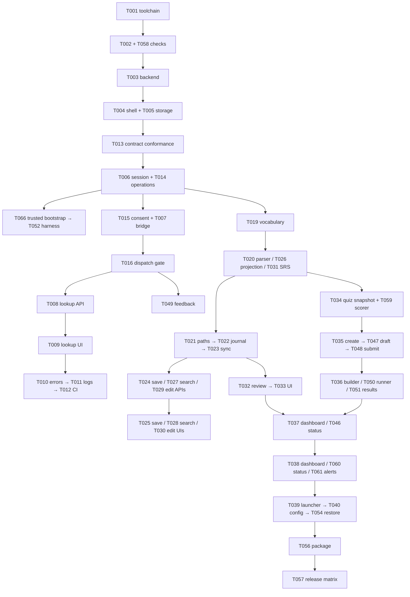

# Task plan — Vocabulary application v1

**Date:** 29/09/2026 (`Asia/Bangkok`)  
**Planning prerequisite:** SPEC_STATUS, ARCHITECTURE_STATUS và REVIEW_STATUS đều `READY_FOR_PLANNING`.  
**Implementation state:** Chưa có application source/manifest/lockfile/CI. Tất cả 66 task là `TODO`.  
**Canonical task list:** [tasks/todo.md](../tasks/todo.md). [tasks/plan.md](../tasks/plan.md) trỏ về file này.  
**Rules:** [CONSTRAINTS.md](../CONSTRAINTS.md), [AGENTS.md](../AGENTS.md), [task template](../tasks/_template.md).

## Scope và decision authority

Kế hoạch xây local Windows vocabulary app theo sáu capability của [spec](spec.md), [API contract](api-contract.md), [UI architecture](ui-architecture.md), [security review](security-review.md), [observability plan](observability-plan.md), ADR-0001–0004 và [review closure](reviews/spec-architecture-review-001.md).

Runtime: React/TypeScript/Vite static UI + Python/FastAPI/Pydantic + SQLite/SQLAlchemy/Alembic. Antigravity v4.8.4 là loopback proxy được client backend sử dụng; v1 model `gemini-3.8-flash-high`, primary route/configured-account, không automatic fallback. Paid fallback có thể được thêm bởi policy version mới với disclosure và consent mới.

User đã ủy quyền chọn defaults hợp lý để đóng các design blockers. T013 phải chuẩn hóa những ví dụ/chi tiết còn chưa xác định thành oracle trước khi code phụ thuộc: quiz total3 trong ví dụ nhưng min5 trong ADR; HARD wording; source ID cho ngày mới; external editor không nhận HTTP409; rubric, session lifecycle, correct-answer/explanation disclosure và terminal-result reads. Task này dùng precedence ADR-0004 và authority đã ghi; chỉ hỏi owner nếu quyết định vượt scope/cost/privacy đã được ủy quyền.

`READY_FOR_IMPLEMENTATION` nghĩa là có thể bắt đầu thực hiện kế hoạch theo dependencies từ T001. Nó không đánh dấu application hoặc các task downstream đã được kiểm chứng. T013 là gate bắt buộc cho business contracts; release còn cần evidence Windows/security/semantic/performance/accessibility trong T057.

## Thứ tự task — dependency order đã kiểm tra

ID giữ ổn định qua lần chia nhỏ; thứ tự chạy nằm ở cột đầu. Có thể chọn task ready khác khi dependencies hoàn tất và không xung đột quyền sửa file.

| Thứ tự | Task | Đầu ra nhỏ | Dependencies bắt buộc | Model đề xuất |
|---:|---|---|---|---|
| 1 | [T001](../tasks/t001-toolchain-repository-skeleton.md) | Pin toolchain và repository skeleton | — | Gemini |
| 2 | [T002](../tasks/t002-quality-gates-test-runner-build.md) | Frontend lint, typecheck và test runner | T001 | Gemini |
| 3 | [T058](../tasks/t058-python-quality-gates.md) | Python lint, types, pytest và coverage runner | T001 | Gemini |
| 4 | [T003](../tasks/t003-backend-skeleton.md) | FastAPI app factory và health | T002, T058 | Gemini |
| 5 | [T004](../tasks/t004-frontend-shell-routes.md) | React shell, route map và landmarks | T003 | Gemini |
| 6 | [T005](../tasks/t005-database-schema-migrations.md) | SQLite connection và migration zero | T003 | GPT-6 Astra |
| 7 | [T053](../tasks/t053-quality-security-gates.md) | Coverage và quality-floor guard | T002, T058, T003, T004 | GPT-6 Astra |
| 8 | [T063](../tasks/t063-security-scan-tooling.md) | Secret và code/dependency security scan gates | T001, T053 | GPT-6 Astra |
| 9 | [T013](../tasks/t013-contract-conformance.md) | Chuẩn hóa ví dụ và quyết định contract còn mơ hồ | T005 | GPT-6 Astra |
| 10 | [T006](../tasks/t006-api-core-contract-foundation.md) | Bootstrap session và HTTP guards | T003, T013 | GPT-6 Astra |
| 11 | [T014](../tasks/t014-operations-idempotency.md) | Durable operation ledger và idempotency | T005, T006 | GPT-6 Astra |
| 12 | [T017](../tasks/t017-typed-api-client.md) | Generated DTO và typed fetch client | T006, T014, T002 | Gemini |
| 13 | [T066](../tasks/t066-browser-bootstrap.md) | Trusted browser bootstrap page | T004, T006 | GPT-6 Astra |
| 14 | [T052](../tasks/t052-browser-test-harness.md) | Browser harness với local fake API/bridge | T004, T006, T017, T066 | Gemini |
| 15 | [T062](../tasks/t062-architecture-gates.md) | Architecture import boundary gates | T053, T003, T004, T017 | GPT-6 Astra |
| 16 | [T015](../tasks/t015-consent-api.md) | Persist consent singleton và GET/PUT/DELETE | T014 | GPT-6 Astra |
| 17 | [T007](../tasks/t007-bridge-policy-consent-adapter.md) | Antigravity transport adapter với fake proxy | T006, T013 | GPT-6 Astra |
| 18 | [T016](../tasks/t016-dispatch-fence.md) | Consent admission fence trước AI dispatch | T015, T007 | GPT-6 Astra |
| 19 | [T018](../tasks/t018-consent-ui.md) | Consent dialog và Status panel | T004, T015, T017, T052 | Gemini |
| 20 | [T019](../tasks/t019-vocabulary-schema.md) | Schema vocabulary, source links và preview | T015 | GPT-6 Astra |
| 21 | [T008](../tasks/t008-lookup-api-vertical-slice.md) | POST lookup trả preview đã validate | T007, T014, T016, T019, T017 | GPT-6 Astra |
| 22 | [T009](../tasks/t009-lookup-ui-vertical-slice.md) | Lookup UI gọi API thật qua client | T004, T008, T017, T018, T052 | Gemini |
| 23 | [T010](../tasks/t010-error-handling-recovery.md) | Typed UI recovery cho common error codes | T009, T052 | Gemini |
| 24 | [T011](../tasks/t011-observability-instrumentation.md) | Local JSON logs, correlation và span boundary | T010 | GPT-6 Astra |
| 25 | [T012](../tasks/t012-ci-pipeline.md) | CI lõi cho build và tests | T011, T053, T062, T063 | Gemini |
| 26 | [T020](../tasks/t020-markdown-parser.md) | Lossless Markdown parser/serializer | T019, T013 | Gemini |
| 27 | [T026](../tasks/t026-search-projection.md) | Vietnamese normalized n-gram projection | T019, T013 | GPT-6 Astra |
| 28 | [T031](../tasks/t031-review-schema.md) | Review/card schema và deterministic SRS | T019, T005, T013 | GPT-6 Astra |
| 29 | [T021](../tasks/t021-safe-source-files.md) | Allowlisted Windows source file adapter | T020 | GPT-6 Astra |
| 30 | [T022](../tasks/t022-source-journal.md) | Durable source journal và crash reconciliation | T021, T014, T031 | GPT-6 Astra |
| 31 | [T023](../tasks/t023-source-sync.md) | Startup/watcher sync và source API | T022, T026 | GPT-6 Astra |
| 32 | [T024](../tasks/t024-save-api.md) | Explicit save preview vào Markdown và cards | T008, T023, T031 | GPT-6 Astra |
| 33 | [T025](../tasks/t025-save-ui-audio.md) | Save lookup preview và local pronunciation | T009, T024, T052 | Gemini |
| 34 | [T027](../tasks/t027-search-api.md) | Search/detail API có cursor và filters | T026, T006, T017 | Gemini |
| 35 | [T028](../tasks/t028-search-ui.md) | Search/detail read flow | T027, T017, T010, T052 | Gemini |
| 36 | [T029](../tasks/t029-edit-api.md) | Revision-safe word-form edit API | T024, T027, T017 | GPT-6 Astra |
| 37 | [T030](../tasks/t030-edit-ui.md) | Edit form và conflict dialog | T029, T028, T052 | Gemini |
| 38 | [T032](../tasks/t032-review-api.md) | Review queue và review event API | T031, T023, T027, T006, T017 | GPT-6 Astra |
| 39 | [T033](../tasks/t033-review-ui.md) | Flashcard review flow | T032, T004, T017, T052 | Gemini |
| 40 | [T059](../tasks/t059-quiz-scoring.md) | Pure quiz scoring và weakest-rating oracle | T031, T013 | GPT-6 Astra |
| 41 | [T034](../tasks/t034-quiz-schema.md) | Quiz immutable snapshot schema | T031, T022, T013 | GPT-6 Astra |
| 42 | [T035](../tasks/t035-quiz-api.md) | Quiz creation và snapshot retrieval API | T034, T016, T059, T023, T014, T017 | GPT-6 Astra |
| 43 | [T036](../tasks/t036-quiz-ui.md) | Quiz builder UI dùng generation API | T035, T018, T010, T017, T052 | Gemini |
| 44 | [T047](../tasks/t047-quiz-autosave-api.md) | Quiz answer draft API với revision | T035, T014, T017 | GPT-6 Astra |
| 45 | [T050](../tasks/t050-quiz-runner-ui.md) | Quiz runner và revision-aware autosave UI | T047, T036, T017, T010, T052 | Gemini |
| 46 | [T048](../tasks/t048-quiz-submit-api.md) | Quiz submission và atomic SRS handoff | T047, T032, T059, T017 | GPT-6 Astra |
| 47 | [T049](../tasks/t049-writing-feedback-api.md) | Writing feedback API và history retry | T047, T016, T034, T014, T017 | GPT-6 Astra |
| 48 | [T051](../tasks/t051-quiz-result-feedback-ui.md) | Submit/result và writing feedback UI | T050, T048, T049, T018, T052 | Gemini |
| 49 | [T037](../tasks/t037-dashboard-formulas.md) | Dashboard summary API và streak formulas | T023, T032, T048, T011, T017 | GPT-6 Astra |
| 50 | [T046](../tasks/t046-metrics-alerts-runbooks.md) | Local RED metrics và operational Status API | T011, T037, T023, T016, T017 | GPT-6 Astra |
| 51 | [T060](../tasks/t060-status-ui.md) | Operational Status screen và consent integration | T046, T018, T010, T052 | Gemini |
| 52 | [T038](../tasks/t038-dashboard-ui.md) | Learning Dashboard UI | T037, T004, T017, T010, T052 | Gemini |
| 53 | [T061](../tasks/t061-alerts-runbooks.md) | Local symptom alerts và runbook links | T046, T060, T063 | GPT-6 Astra |
| 54 | [T039](../tasks/t039-launcher.md) | Windows launcher single-instance/bootstrap | T006, T004, T023, T060 | GPT-6 Astra |
| 55 | [T040](../tasks/t040-first-run-recovery.md) | Native first-run configuration và protected key store | T039, T007, T020, T005 | GPT-6 Astra |
| 56 | [T054](../tasks/t054-restore-recovery-drill.md) | Staging restore và migration recovery drill | T040, T022, T048, T049 | GPT-6 Astra |
| 57 | [T041](../tasks/t041-security-hardening.md) | Browser/API/filesystem hardening evidence | T040, T021, T025, T049, T052, T063 | GPT-6 Astra |
| 58 | [T042](../tasks/t042-performance-fixture.md) | Deterministic100k search benchmark fixture | T026 | GPT-6 Astra |
| 59 | [T065](../tasks/t065-search-performance-evidence.md) | Search browser timing trên100k fixture | T042, T028, T052 | GPT-6 Astra |
| 60 | [T064](../tasks/t064-ui-performance-harness.md) | Local Lighthouse performance harness | T052, T038 | Gemini |
| 61 | [T043](../tasks/t043-accessibility-evidence.md) | WCAG 2.2 AA browser/manual evidence | T025, T028, T030, T033, T036, T050, T051, T038, T060, T052, T064 | GPT-6 Astra |
| 62 | [T055](../tasks/t055-ai-content-evidence.md) | Human-reviewed semantic fixture và optional AI smoke | T008, T035, T049, T040, T041 | GPT-6 Astra |
| 63 | [T056](../tasks/t056-windows-package.md) | Reproducible Windows package và shortcut | T039, T040, T054, T004 | GPT-6 Astra |
| 64 | [T044](../tasks/t044-release-contract-audit.md) | Generated contract and cross-doc audit | T013, T008, T024, T027, T029, T032, T035, T047, T048, T049, T037, T046, T061 | GPT-6 Astra |
| 65 | [T045](../tasks/t045-git-release-hygiene.md) | Git hooks, branch and commit hygiene | T012, T063 | Gemini |
| 66 | [T057](../tasks/t057-release-verification.md) | Windows/offline release evidence matrix | T041, T043, T044, T054, T056, T061, T055, T065 | GPT-6 Astra |

## Vertical slices và checkpoints chính

1. **Toolchain/skeleton:** T001/T002/T058 → backend T003 → frontend shell T004 → storage migration zero T005. Install/build/test commands được xác minh tại task owner.
2. **Quality và contract:** T053/T063/T013, rồi browser session/operation/DTO/harness T006/T014/T017/T066/T052/T062.
3. **AI lookup API → UI:** consent/bridge/admission T015/T007/T016, panel T018, vocabulary schema T019, preview API T008, lookup UI T009, error recovery T010, logs T011 và early CI T012.
4. **Save/search/edit:** parser/projection/SRS foundation T020/T026/T031; safe paths/journal/sync T021/T022/T023; save API/UI T024/T025; search API/UI T027/T028; edit API/UI T029/T030.
5. **Review và assessment:** queue/event T032 → flashcard UI T033. Scorer T059, quiz snapshot T034, generation T035 → builder T036, autosave T047 → runner T050, atomic submit T048, feedback T049 → result UI T051.
6. **Dashboard/operations:** learning summary T037, metrics/status T046, Status UI T060, Dashboard UI T038, symptom alerts T061.
7. **Windows/release evidence:** launcher/config/restore T039/T040/T054, security T041, search fixture/timing T042/T065, Lighthouse/a11y T064/T043, semantic fixture/provider dry-run T055, Windows package T056, final contract audit T044, Git hygiene T045 và full matrix T057.

### Checkpoints sau mỗi 2–3 task

- **CP01** sau T001, T002, T058: kiểm tra acceptance/evidence của từng thẻ, applicable floor/lint/types/tests và integration/build đã tồn tại; ghi kết quả vào todo/handoff trước task kế tiếp.
- **CP02** sau T003, T004, T005: kiểm tra acceptance/evidence của từng thẻ, applicable floor/lint/types/tests và integration/build đã tồn tại; ghi kết quả vào todo/handoff trước task kế tiếp.
- **CP03** sau T053, T063, T013: kiểm tra acceptance/evidence của từng thẻ, applicable floor/lint/types/tests và integration/build đã tồn tại; ghi kết quả vào todo/handoff trước task kế tiếp.
- **CP04** sau T006, T014, T017: kiểm tra acceptance/evidence của từng thẻ, applicable floor/lint/types/tests và integration/build đã tồn tại; ghi kết quả vào todo/handoff trước task kế tiếp.
- **CP05** sau T066, T052, T062: kiểm tra acceptance/evidence của từng thẻ, applicable floor/lint/types/tests và integration/build đã tồn tại; ghi kết quả vào todo/handoff trước task kế tiếp.
- **CP06** sau T015, T007, T016: kiểm tra acceptance/evidence của từng thẻ, applicable floor/lint/types/tests và integration/build đã tồn tại; ghi kết quả vào todo/handoff trước task kế tiếp.
- **CP07** sau T018, T019, T008: kiểm tra acceptance/evidence của từng thẻ, applicable floor/lint/types/tests và integration/build đã tồn tại; ghi kết quả vào todo/handoff trước task kế tiếp.
- **CP08** sau T009, T010, T011: kiểm tra acceptance/evidence của từng thẻ, applicable floor/lint/types/tests và integration/build đã tồn tại; ghi kết quả vào todo/handoff trước task kế tiếp.
- **CP09** sau T012, T020, T026: kiểm tra acceptance/evidence của từng thẻ, applicable floor/lint/types/tests và integration/build đã tồn tại; ghi kết quả vào todo/handoff trước task kế tiếp.
- **CP10** sau T031, T021, T022: kiểm tra acceptance/evidence của từng thẻ, applicable floor/lint/types/tests và integration/build đã tồn tại; ghi kết quả vào todo/handoff trước task kế tiếp.
- **CP11** sau T023, T024, T025: kiểm tra acceptance/evidence của từng thẻ, applicable floor/lint/types/tests và integration/build đã tồn tại; ghi kết quả vào todo/handoff trước task kế tiếp.
- **CP12** sau T027, T028, T029: kiểm tra acceptance/evidence của từng thẻ, applicable floor/lint/types/tests và integration/build đã tồn tại; ghi kết quả vào todo/handoff trước task kế tiếp.
- **CP13** sau T030, T032, T033: kiểm tra acceptance/evidence của từng thẻ, applicable floor/lint/types/tests và integration/build đã tồn tại; ghi kết quả vào todo/handoff trước task kế tiếp.
- **CP14** sau T059, T034, T035: kiểm tra acceptance/evidence của từng thẻ, applicable floor/lint/types/tests và integration/build đã tồn tại; ghi kết quả vào todo/handoff trước task kế tiếp.
- **CP15** sau T036, T047, T050: kiểm tra acceptance/evidence của từng thẻ, applicable floor/lint/types/tests và integration/build đã tồn tại; ghi kết quả vào todo/handoff trước task kế tiếp.
- **CP16** sau T048, T049, T051: kiểm tra acceptance/evidence của từng thẻ, applicable floor/lint/types/tests và integration/build đã tồn tại; ghi kết quả vào todo/handoff trước task kế tiếp.
- **CP17** sau T037, T046, T060: kiểm tra acceptance/evidence của từng thẻ, applicable floor/lint/types/tests và integration/build đã tồn tại; ghi kết quả vào todo/handoff trước task kế tiếp.
- **CP18** sau T038, T061, T039: kiểm tra acceptance/evidence của từng thẻ, applicable floor/lint/types/tests và integration/build đã tồn tại; ghi kết quả vào todo/handoff trước task kế tiếp.
- **CP19** sau T040, T054, T041: kiểm tra acceptance/evidence của từng thẻ, applicable floor/lint/types/tests và integration/build đã tồn tại; ghi kết quả vào todo/handoff trước task kế tiếp.
- **CP20** sau T042, T065, T064: kiểm tra acceptance/evidence của từng thẻ, applicable floor/lint/types/tests và integration/build đã tồn tại; ghi kết quả vào todo/handoff trước task kế tiếp.
- **CP21** sau T043, T055, T056: kiểm tra acceptance/evidence của từng thẻ, applicable floor/lint/types/tests và integration/build đã tồn tại; ghi kết quả vào todo/handoff trước task kế tiếp.
- **CP22** sau T044, T045, T057: kiểm tra acceptance/evidence của từng thẻ, applicable floor/lint/types/tests và integration/build đã tồn tại; ghi kết quả vào todo/handoff trước task kế tiếp.

Mỗi checkpoint ghi reviewed files, exact commands và outcome. Checks Windows/browser/provider không chạy được phải PENDING. Chỉ chạy build sau task đã tạo entry point; thiếu runtime không phải test pass. Không check task DONE khi có required evidence còn thiếu.

## Task có thể chạy song song

Các nhóm dưới đây dùng module paths tách biệt; giữ riêng checkout/temporary data root và chỉ merge khi dependencies/gates pass. Đây là thông tin lập kế hoạch, không tự tạo agents/worktrees.

| Sau điều kiện | Có thể song song | Điều kiện tránh conflict |
|---|---|---|
| T001 | T002 và T058 | Frontend config vs Python config/test files; lockfile do một owner giữ |
| T003 | T004 và T005 | React shell vs SQLite bootstrap; không sửa cùng manifest |
| T015/T017 | T007 và T019 | Bridge transport vs vocabulary migration/model; không cập nhật main.py từ hai task cùng lúc |
| T019/T013 | T020 và T026; T031 | Parser vs normalized search vs review schema; migration owner duy nhất |
| T023/T027/T031 | T028 và T032 | Frontend search routes vs backend review routes |
| T034/T047/T048/T049 | UI feature với independent backend verification | Shared AppShell.tsx/main.py phải tuần tự hoặc merge có review |
| Runtime hoàn chỉnh | T041, T043, T044, T054 evidence phù hợp | Task write sets phải disjoint; không dùng cùng temp DB/source tree/browser profile |

T064/T065 có thể chạy các phép đo song song **sau khi** command/config integration đã merge; cùng sửa package.json phải tuần tự. Những task UI cùng sửa AppShell.tsx, API cùng sửa main.py, hoặc cùng migration chain không được chạy song song trong cùng working tree.

## Task bắt buộc tuần tự

- Runtime foundation trước mọi executable task; T013 trước freezing product semantics.
- Operation ledger → consent policy/events → dispatch admission → mọi AI endpoint.
- T005 migration zero → T014 operations → T015 consent → T019 vocabulary → T031 review → T022 journal → T034 quiz → T049 feedback. Một Alembic head, không branch migrations song song.
- Source parser/safe-file adapter/journal phải có trước live sync và trước save/PATCH.
- API trước UI flow dùng API đó; DTO/client/harness có trước integration tests.
- Quiz autosave được đối soát trước submission; score/result/SRS handoff cùng atomic operation. Feedback xử lý riêng và không thay score.
- Release gate T057 sau tất cả required product/security/quality/Windows evidence; không suy ra readiness từ unit tests.

## Dependency graph

Sơ đồ nhỏ thể hiện những đường quan trọng; bảng task và adjacency list dưới đây là graph đầy đủ.



### Graph đầy đủ — `task <- prerequisite`

```text
T001 <- ROOT
T002 <- T001
T058 <- T001
T003 <- T002, T058
T004 <- T003
T005 <- T003
T053 <- T002, T058, T003, T004
T063 <- T001, T053
T013 <- T005
T006 <- T003, T013
T014 <- T005, T006
T017 <- T006, T014, T002
T066 <- T004, T006
T052 <- T004, T006, T017, T066
T062 <- T053, T003, T004, T017
T015 <- T014
T007 <- T006, T013
T016 <- T015, T007
T018 <- T004, T015, T017, T052
T019 <- T015
T008 <- T007, T014, T016, T019, T017
T009 <- T004, T008, T017, T018, T052
T010 <- T009, T052
T011 <- T010
T012 <- T011, T053, T062, T063
T020 <- T019, T013
T026 <- T019, T013
T031 <- T019, T005, T013
T021 <- T020
T022 <- T021, T014, T031
T023 <- T022, T026
T024 <- T008, T023, T031
T025 <- T009, T024, T052
T027 <- T026, T006, T017
T028 <- T027, T017, T010, T052
T029 <- T024, T027, T017
T030 <- T029, T028, T052
T032 <- T031, T023, T027, T006, T017
T033 <- T032, T004, T017, T052
T059 <- T031, T013
T034 <- T031, T022, T013
T035 <- T034, T016, T059, T023, T014, T017
T036 <- T035, T018, T010, T017, T052
T047 <- T035, T014, T017
T050 <- T047, T036, T017, T010, T052
T048 <- T047, T032, T059, T017
T049 <- T047, T016, T034, T014, T017
T051 <- T050, T048, T049, T018, T052
T037 <- T023, T032, T048, T011, T017
T046 <- T011, T037, T023, T016, T017
T060 <- T046, T018, T010, T052
T038 <- T037, T004, T017, T010, T052
T061 <- T046, T060, T063
T039 <- T006, T004, T023, T060
T040 <- T039, T007, T020, T005
T054 <- T040, T022, T048, T049
T041 <- T040, T021, T025, T049, T052, T063
T042 <- T026
T065 <- T042, T028, T052
T064 <- T052, T038
T043 <- T025, T028, T030, T033, T036, T050, T051, T038, T060, T052, T064
T055 <- T008, T035, T049, T040, T041
T056 <- T039, T040, T054, T004
T044 <- T013, T008, T024, T027, T029, T032, T035, T047, T048, T049, T037, T046, T061
T045 <- T012, T063
T057 <- T041, T043, T044, T054, T056, T061, T055, T065
```

## Command registry và hiện trạng

Mọi lệnh application dưới đây **chưa tồn tại ở repository hiện tại**; owner phải cài/pin công cụ, tạo command và chứng minh exit codes bằng tests. Chỉ lệnh read-only của planning như `git status --short`, `rg` và kiểm tra structure/graph chạy được trong session này.

| Command contract | Task owner | Output/gate |
|---|---|---|
| `npm ci`; locked Python install recipe | T001 | Reproducible lockfiles and toolchain.md |
| `npm run lint`, `typecheck`, `test:frontend`, `build` | T002; build entry T004 | ESLint/tsc/Vitest/build; no empty-suite green |
| `python -m ruff check .`, `python -m mypy backend`, `python -m pytest` | T058/T003 | Python checks and one-run coverage report |
| `npm run export:contract`, `test:contract` | T017 | OpenAPI + generated DTO schema comparison |
| `npm run test:e2e`, `test:a11y` | T052; full evidence T043 | Playwright local fake-boundary preview |
| `npm run format:check`, `floor:check`, `coverage:check` | T053 | Zero violations; changed lines ≥80%; recorded ratchet |
| `npm run architecture:check` | T062 | Dependency-cruiser + Python import-linter |
| `npm run security:secrets`, `security:code`, `security:deps` | T063 | Redacted Gitleaks/Semgrep/OSV severity gates |
| `npm run check:fast`, `check:task`, `check:full` | T053/T062/T063 | Aggregate scripts mirror CONSTRAINTS |
| `npm run benchmark:ui` | T064 | Lighthouse LCP≤2.5s/CLS≤0.1 |
| `npm run benchmark:search` | T065; fixture T042 | Windows100k p95≤1s and strict AC-07 query≤1000ms |

CLI flags/version availability phải được owner kiểm tra bằng official docs khi cài. Command surface là kế hoạch, không khẳng định package/version đã có trên máy.

## Model allocation

Đây là phân công theo rủi ro/phạm vi task do người dùng yêu cầu, không khẳng định khả năng hay availability của từng model. Mỗi model phải đọc cùng rules/contracts và cung cấp cùng evidence; có thể chuyển model nhưng vẫn giữ gates.

### Task phù hợp với Gemini

- [T001](../tasks/t001-toolchain-repository-skeleton.md): Pin toolchain và repository skeleton.
- [T002](../tasks/t002-quality-gates-test-runner-build.md): Frontend lint, typecheck và test runner.
- [T003](../tasks/t003-backend-skeleton.md): FastAPI app factory và health.
- [T004](../tasks/t004-frontend-shell-routes.md): React shell, route map và landmarks.
- [T009](../tasks/t009-lookup-ui-vertical-slice.md): Lookup UI gọi API thật qua client.
- [T010](../tasks/t010-error-handling-recovery.md): Typed UI recovery cho common error codes.
- [T012](../tasks/t012-ci-pipeline.md): CI lõi cho build và tests.
- [T017](../tasks/t017-typed-api-client.md): Generated DTO và typed fetch client.
- [T018](../tasks/t018-consent-ui.md): Consent dialog và Status panel.
- [T020](../tasks/t020-markdown-parser.md): Lossless Markdown parser/serializer.
- [T025](../tasks/t025-save-ui-audio.md): Save lookup preview và local pronunciation.
- [T027](../tasks/t027-search-api.md): Search/detail API có cursor và filters.
- [T028](../tasks/t028-search-ui.md): Search/detail read flow.
- [T030](../tasks/t030-edit-ui.md): Edit form và conflict dialog.
- [T033](../tasks/t033-review-ui.md): Flashcard review flow.
- [T036](../tasks/t036-quiz-ui.md): Quiz builder UI dùng generation API.
- [T038](../tasks/t038-dashboard-ui.md): Learning Dashboard UI.
- [T045](../tasks/t045-git-release-hygiene.md): Git hooks, branch and commit hygiene.
- [T050](../tasks/t050-quiz-runner-ui.md): Quiz runner và revision-aware autosave UI.
- [T051](../tasks/t051-quiz-result-feedback-ui.md): Submit/result và writing feedback UI.
- [T052](../tasks/t052-browser-test-harness.md): Browser harness với local fake API/bridge.
- [T058](../tasks/t058-python-quality-gates.md): Python lint, types, pytest và coverage runner.
- [T060](../tasks/t060-status-ui.md): Operational Status screen và consent integration.
- [T064](../tasks/t064-ui-performance-harness.md): Local Lighthouse performance harness.

Các task này có input/contract và test oracle rõ, thường là wiring/config/UI hoặc evidence harness. Task UI consent/autosave/result vẫn cần review tập trung boundary/privacy/concurrency trước merge.

### Task cần GPT-6 Astra

- [T005](../tasks/t005-database-schema-migrations.md): SQLite connection và migration zero.
- [T006](../tasks/t006-api-core-contract-foundation.md): Bootstrap session và HTTP guards.
- [T007](../tasks/t007-bridge-policy-consent-adapter.md): Antigravity transport adapter với fake proxy.
- [T008](../tasks/t008-lookup-api-vertical-slice.md): POST lookup trả preview đã validate.
- [T011](../tasks/t011-observability-instrumentation.md): Local JSON logs, correlation và span boundary.
- [T013](../tasks/t013-contract-conformance.md): Chuẩn hóa ví dụ và quyết định contract còn mơ hồ.
- [T014](../tasks/t014-operations-idempotency.md): Durable operation ledger và idempotency.
- [T015](../tasks/t015-consent-api.md): Persist consent singleton và GET/PUT/DELETE.
- [T016](../tasks/t016-dispatch-fence.md): Consent admission fence trước AI dispatch.
- [T019](../tasks/t019-vocabulary-schema.md): Schema vocabulary, source links và preview.
- [T021](../tasks/t021-safe-source-files.md): Allowlisted Windows source file adapter.
- [T022](../tasks/t022-source-journal.md): Durable source journal và crash reconciliation.
- [T023](../tasks/t023-source-sync.md): Startup/watcher sync và source API.
- [T024](../tasks/t024-save-api.md): Explicit save preview vào Markdown và cards.
- [T026](../tasks/t026-search-projection.md): Vietnamese normalized n-gram projection.
- [T029](../tasks/t029-edit-api.md): Revision-safe word-form edit API.
- [T031](../tasks/t031-review-schema.md): Review/card schema và deterministic SRS.
- [T032](../tasks/t032-review-api.md): Review queue và review event API.
- [T034](../tasks/t034-quiz-schema.md): Quiz immutable snapshot schema.
- [T035](../tasks/t035-quiz-api.md): Quiz creation và snapshot retrieval API.
- [T037](../tasks/t037-dashboard-formulas.md): Dashboard summary API và streak formulas.
- [T039](../tasks/t039-launcher.md): Windows launcher single-instance/bootstrap.
- [T040](../tasks/t040-first-run-recovery.md): Native first-run configuration và protected key store.
- [T041](../tasks/t041-security-hardening.md): Browser/API/filesystem hardening evidence.
- [T042](../tasks/t042-performance-fixture.md): Deterministic100k search benchmark fixture.
- [T043](../tasks/t043-accessibility-evidence.md): WCAG 2.2 AA browser/manual evidence.
- [T044](../tasks/t044-release-contract-audit.md): Generated contract and cross-doc audit.
- [T046](../tasks/t046-metrics-alerts-runbooks.md): Local RED metrics và operational Status API.
- [T047](../tasks/t047-quiz-autosave-api.md): Quiz answer draft API với revision.
- [T048](../tasks/t048-quiz-submit-api.md): Quiz submission và atomic SRS handoff.
- [T049](../tasks/t049-writing-feedback-api.md): Writing feedback API và history retry.
- [T053](../tasks/t053-quality-security-gates.md): Coverage và quality-floor guard.
- [T054](../tasks/t054-restore-recovery-drill.md): Staging restore và migration recovery drill.
- [T055](../tasks/t055-ai-content-evidence.md): Human-reviewed semantic fixture và optional AI smoke.
- [T056](../tasks/t056-windows-package.md): Reproducible Windows package và shortcut.
- [T057](../tasks/t057-release-verification.md): Windows/offline release evidence matrix.
- [T059](../tasks/t059-quiz-scoring.md): Pure quiz scoring và weakest-rating oracle.
- [T061](../tasks/t061-alerts-runbooks.md): Local symptom alerts và runbook links.
- [T062](../tasks/t062-architecture-gates.md): Architecture import boundary gates.
- [T063](../tasks/t063-security-scan-tooling.md): Secret và code/dependency security scan gates.
- [T065](../tasks/t065-search-performance-evidence.md): Search browser timing trên100k fixture.
- [T066](../tasks/t066-browser-bootstrap.md): Trusted browser bootstrap page.

Ưu tiên review độc lập khi task chứa durable commit, race ordering, source recovery, consent/routing, migration, SRS mapping hoặc security. Kế hoạch không tự gọi model/agent khác hoặc bật recurring execution.

## Scope, context và Git handoff

- Mỗi thẻ có explicit source allowlist ≤5 file viết tay, generated artifacts và common bookkeeping. Task phình lớn phải chia tiếp trước chỉnh source ngoài scope.
- Đọc CONSTRAINTS/AGENTS + relevant spec section + dependency handoff + exact source/tests. Treat external/model/Markdown data as untrusted.
- Source branches theo AGENTS: `feature/task-<id>-<slug>` khi branching đã được cho phép. Atomic Conventional Commit có task scope; task card cung cấp message đề xuất.
- Repository hiện chưa có commit/remote; không auto stage all. Trước initial commit phải review untracked assets/secrets, kể cả screenshot key từng bị lộ và key rotation evidence.
- Handoff gồm current task status, changed/untouched files, commands/outcomes, environment, residual blockers và next ready task. Không đánh dấu DONE sau process crash/interrupt.
- Existing review/ADR history được giữ nguyên; conformance changes có ADR/cited precedence, không đổi REVIEW_STATUS bằng tay.

## Verification của planning session

Trước khi xác nhận plan complete phải kiểm tra: một task/card, unique IDs, required fields, ≤5 authored files, no unresolved patch markers, dependency references tồn tại, graph không chu kỳ, thứ tự topological, checklist/table đồng bộ và linked local docs đúng (future outputs được ghi planned).

Kết quả kiểm tra structure/graph/order/links đã ghi trong [planning-validation-001](reviews/planning-validation-001.md): 66 cards, 225 edges, 22 checkpoints và không có lỗi validation. Application lint/build/tests/security scans và Windows/provider evidence chưa được chạy; các task cards là yêu cầu cho implementation sessions.

PLAN_STATUS: READY_FOR_IMPLEMENTATION

## Local development-agent infrastructure (01/10/2026)

The owner explicitly authorized Level 1 implementation outside the T001–T066 product
DAG. Its bounded slices are [T067](../tasks/t067-orchestrator-core.md) (deterministic
core), [T068](../tasks/t068-orchestrator-workflow.md) (depends T067, workflow/CLI),
[T069](../tasks/t069-orchestrator-quality.md) (depends T068, verification ownership)
and [T070](../tasks/t070-orchestrator-baseline-lint.md) (comment-only inherited lint
blocker). Each owns at most five handwritten implementation/config/test files.
Common bookkeeping and the user-authorized [guide](orchestrator.md) and
[ADR-0006](adr/0006-local-agent-orchestration.md) are separate documentation.
No product task or checkpoint is marked complete by this infrastructure request.

The host runs one synchronous pipeline per process, at most three independent tasks
with isolated outside worktrees and JSON run directories. Planning/Worker/Auditor can
run concurrently; repository-global integration is serialized and promoted only after
candidate verification. Dependent tasks start after actual integration, not from a
numbered task ordering. No DAG scheduling, remote Git, database or paid smoke test
is introduced. Existing manual/dirty worktrees are preserved and never reused blindly.

T067–T070 are DONE on their feature branch with [final verification](reviews/orchestrator-verification-001.md). This is implementation completion, not promotion to main or a product checkpoint closure.
